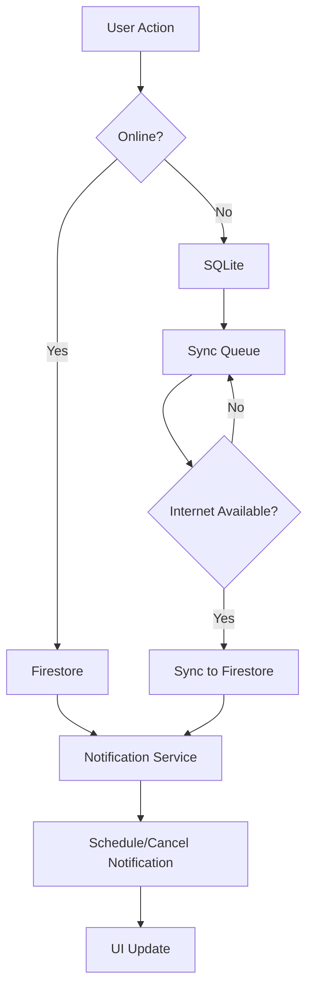

<h1 align="center">Task Manager</h1>

<p align="center">
  Offline-first task manager with a native iOS feel — <b>Flutter</b> · <b>Firebase</b> · <b>SQLite</b>
</p>

<p align="center">
  
  
  
  
  
</p>

<p align="center">
  <a href="https://github.com/linverno-tm/flutter-task-manager/actions/workflows/flutter_ci.yml">
    
  </a>
</p>

---

## Overview

A task manager that keeps working when the network does not. Every write lands
in a local SQLite database first and is mirrored to Cloud Firestore when a
connection is actually available — not merely when the OS claims one is.

**Highlights**

- Offline-first writes: create, edit and complete tasks with no connection,
  then let the sync service reconcile them
- Google Sign-In through Firebase Auth, with per-user Firestore scoping
- Scheduled local notifications for deadlines, cancelled automatically when a
  task is completed or deleted
- Calendar and statistics views built from the same task stream
- 100% Cupertino widgets — no Material chrome leaking into an iOS-styled app

## Offline sync

The part worth reading the code for.

```
       write
         │
         ▼
   ┌───────────┐   isSynced = false
   │  SQLite   │◄──────────────────────┐
   └─────┬─────┘                       │
         │ reachable?                  │
         ▼                             │
   ┌───────────┐   yes   ┌──────────┐  │  no
   │ reachable │────────►│ Firestore│  │
   │   check   │         └──────────┘  │
   └─────┬─────┘                       │
         └───────────────────────────► │
                                    pending queue
```

Two details make this reliable:

**Connectivity is verified, not assumed.** `connectivity_plus` reports that an
interface exists — a captive-portal Wi-Fi or a hotspot with no upstream both
look "connected". `SyncService.hasInternetConnection()` therefore resolves
`firestore.googleapis.com` with a timeout before deciding the network is usable.

**Sync is an upsert, not an update.** A task created offline is stored under a
client-generated id, so the Firestore document does not exist yet. A plain
`update` throws `not-found` and the task would silently never reach the cloud;
`set(..., SetOptions(merge: true))` creates it instead.

## Project structure

```
lib/
├── main.dart
├── firebase_options.dart
│
├── models/
│   └── task_model.dart              # SQLite + Firestore mapping, copyWith
│
├── service/
│   ├── auth_service/
│   │   └── auth_service.dart        # Firebase Auth + Google Sign-In
│   ├── data/
│   │   ├── database_service.dart    # SQLite schema and queries
│   │   ├── firestore_service.dart   # per-user Firestore collection
│   │   └── sync_service.dart        # reachability + pending queue
│   ├── local_notif_service/
│   │   ├── local_notification_service.dart
│   │   └── permission_service.dart
│   └── task_service/
│       └── task_service.dart        # the API the UI talks to
│
└── screens/
    ├── auth/                        # sign-in
    ├── main/                        # bottom navigation shell
    ├── home/                        # task list, add/edit, drawer
    ├── calendar/                    # month view + tasks for a day
    ├── statistics/                  # progress chart, productivity meter
    └── profile/                     # settings
```

`TaskService` is the only thing the screens talk to; which of SQLite, Firestore
or the sync queue answers a call is an implementation detail behind it.

## Getting started

```bash
git clone https://github.com/linverno-tm/flutter-task-manager.git
cd flutter-task-manager
flutter pub get
```

### Firebase

The repository ships without credentials, so you need your own project:

1. Create a project at [console.firebase.google.com](https://console.firebase.google.com)
2. Add an Android app with package name `com.example.my_tp_2` and drop
   `google-services.json` into `android/app/`
3. Enable **Authentication → Sign-in method → Google**
4. Create a **Cloud Firestore** database and apply these rules:

   ```javascript
   rules_version = '2';
   service cloud.firestore {
     match /databases/{database}/documents {
       match /users/{userId}/tasks/{taskId} {
         allow read, write: if request.auth != null
                            && request.auth.uid == userId;
       }
     }
   }
   ```

5. Regenerate `lib/firebase_options.dart` with `flutterfire configure`

Then:

```bash
flutter run
```

## Tests

```bash
flutter analyze
flutter test
```

The suite covers the `Task` model where correctness actually bites — the two
serialisation formats it has to satisfy at once:

- **SQLite mapping** — booleans stored as integers, dates as ISO-8601, and a
  `toMap → fromMap` round trip that preserves every field
- **Firestore mapping** — local-only fields omitted, booleans kept as booleans,
  dates converted to `Timestamp`, null deadlines written as null
- **defaults** — a task built without a category or priority gets sane ones
- **copyWith** — including the documented fact that it cannot *clear* a
  deadline, since `null` falls through to the current value

CI runs analyze, the suite and a debug APK build on every push.

## Roadmap

- [ ] Full-text search across tasks
- [ ] Recurring tasks
- [ ] Tags in addition to categories
- [ ] Export / import

## License

MIT — see [LICENSE](LICENSE).
# 📝 Flutter Todo App

<div align="center">


**Zamonaviy vazifalar boshqaruvi ilovasi - iOS dizayni, Firebase backend va local notification'lar bilan**

[Demo](#-demo) • [Xususiyatlar](#-asosiy-xususiyatlar) • [O'rnatish](#-ornatish) • [Hujjatlar](#-texnologiyalar)


</div>

---

## 📱 Demo

<div align="center">
  
  
  
  
</div>

> **Eslatma:** Screenshot'lar uchun `screenshots/` papkasiga rasmlar qo'shing

---

## ✨ Asosiy Xususiyatlar

### 🎯 Vazifalar Boshqaruvi
- ✅ **To'liq CRUD operatsiyalar** - Yaratish, o'qish, yangilash, o'chirish
- 🏷️ **Kategoriyalar** - Work, Personal, Shopping, Health, Study
- 🚩 **Prioritet darajalari** - Past, O'rta, Yuqori
- 📅 **Deadline boshqaruvi** - Muddatlarni belgilash va kuzatish
- 🔍 **Smart filtrlash** - Hammasi / Bugun / Bajarilgan / Kutilmoqda

### 🎨 Zamonaviy Dizayn
- 🍎 **100% Cupertino UI** - Native iOS ko'rinishi va his qilish
- 🌙 **Dark Mode** - Zamonaviy qorong'u tema
- 💧 **Water Drop Navigation** - Chiroyli animatsiyali bottom navigation
- 📱 **Fully Responsive** - Barcha ekranlar uchun moslashgan
- 🎭 **Smooth Animations** - Silliq o'tishlar va animatsiyalar

### 📊 Statistika va Tahlil
- 📈 **Interaktiv grafiklar** - Kunlik/Haftalik/Oylik progress
- 💯 **Samaradorlik metr** - Real-time productivity tracking
- 🎯 **Maqsadlar kuzatuvi** - Bajarilgan tasklar statistikasi
- 📉 **Vizual tahlil** - Rangli grafiklar va diagrammalar

### 🔔 Smart Notification'lar
- ⏰ **Local push notifications** - Deadline eslatmalari
- 🔕 **Auto-cancel** - Bajarilgan tasklarni avtomatik olib tashlash
- ⚡ **Exact alarm** - Aniq vaqtda bildirishnomalar
- 🔄 **Reschedule** - Task o'zgarganda avtomatik yangilanish

### 🔄 Online/Offline Sync
- ☁️ **Cloud Firestore** - Real-time cloud database
- 💾 **SQLite** - Lokal offline storage
- 🔄 **Auto-sync** - Avtomatik sinxronlash
- 📶 **Smart sync** - Internet holatiga qarab ishlash
- 🔐 **Data security** - Xavfsiz ma'lumotlar saqlash

### 🔐 Authentication
- 🔑 **Google Sign-In** - Firebase Authentication
- 👤 **User profiles** - Shaxsiy profil boshqaruvi
- 🔒 **Secure** - Xavfsiz kirish va chiqish
- 📧 **Email verification** - Email tasdiqlash

### 🌐 Qo'shimcha Imkoniyatlar
- 🌍 **Multi-language ready** - O'zbek / Русский / English
- 🎨 **Theme switcher** - Dark/Light mode (coming soon)
- 📤 **Data export** - Ma'lumotlarni eksport qilish (coming soon)
- 🔍 **Search** - Qidiruv funksiyasi (coming soon)

---

## 🚀 O'rnatish

### Oldindan Talablar

```bash
Flutter SDK: >=3.0.0
Dart SDK: >=3.0.0
Android Studio / VS Code
Firebase account
Git
```

### 1️⃣ Loyihani Klonlash

```bash
git clone https://github.com/linverno-tm/flutter-todo-app.git
cd flutter-todo-app
```

### 2️⃣ Dependencies O'rnatish

```bash
flutter pub get
```

### 3️⃣ Firebase Sozlash

#### A. Firebase Console Sozlamalari

1. **Firebase Console'ga kiring**
   - [console.firebase.google.com](https://console.firebase.google.com)
   - "Add project" tugmasini bosing
   - Project nomi: `todo-app-flutter`

2. **Android App Qo'shish**
   - Android icon'ga bosing
   - Package name: `com.example.my_tp_2`
   - `google-services.json` yuklab oling
   - Faylni `android/app/` ga joylashtiring

3. **iOS App Qo'shish** (ixtiyoriy)
   - iOS icon'ga bosing
   - Bundle ID: `com.example.myTp2`
   - `GoogleService-Info.plist` yuklab oling
   - Faylni `ios/Runner/` ga joylashtiring

#### B. Firestore Database

1. **Firestore yaratish**
   - "Build" > "Firestore Database"
   - "Create database" > "Start in test mode"
   - Location: tanlang (masalan: `asia-southeast1`)

2. **Security Rules**
   ```javascript
   rules_version = '2';
   service cloud.firestore {
     match /databases/{database}/documents {
       match /users/{userId}/tasks/{taskId} {
         allow read, write: if request.auth != null && request.auth.uid == userId;
       }
     }
   }
   ```

#### C. Authentication Sozlamalari

1. **Authentication yoqish**
   - "Build" > "Authentication"
   - "Get started" tugmasini bosing
   - "Sign-in method" > "Google" > "Enable"
   - Support email kiriting va saqlang

### 4️⃣ Ilovani Ishga Tushirish

```bash
# Android
flutter run

# iOS (macOS kerak)
cd ios
pod install
cd ..
flutter run

# Web (ixtiyoriy)
flutter run -d chrome
```

### 5️⃣ Build Qilish

```bash
# Android APK
flutter build apk --release

# Android App Bundle
flutter build appbundle --release

# iOS (macOS kerak)
flutter build ios --release
```

---

## 🛠 Texnologiyalar

### Core
| Technology | Version | Purpose |
|-----------|---------|---------|
| Flutter | 3.x | UI Framework |
| Dart | 3.x | Programming Language |
| Cupertino | - | iOS Style Widgets |

### Backend & Database
| Service | Purpose |
|---------|---------|
| Firebase Core | Firebase SDK |
| Cloud Firestore | NoSQL Cloud Database |
| Firebase Auth | User Authentication |
| SQLite | Local Database |

### UI & Navigation
| Package | Purpose |
|---------|---------|
| Water Drop Nav Bar | Animated Navigation |
| Google Fonts | Custom Fonts |
| Intl | Date Formatting |

### Notifications & Permissions
| Package | Purpose |
|---------|---------|
| Flutter Local Notifications | Local Push Notifications |
| Timezone | Timezone Management |
| Permission Handler | Runtime Permissions |

### Networking & Sync
| Package | Purpose |
|---------|---------|
| Connectivity Plus | Network Status |
| Custom Sync Service | Online/Offline Sync |

### Storage & State
| Package | Purpose |
|---------|---------|
| Shared Preferences | Local Settings |
| Provider | State Management |
| Path | File Paths |

### Authentication
| Package | Purpose |
|---------|---------|
| Google Sign In | OAuth 2.0 |
| Firebase Auth | User Management |

---

## 📁 Loyiha Strukturasi

```
lib/
│
├── main.dart                          # 🚀 App Entry Point
│
├── 📂 models/
│   └── task_model.dart               # Task data model & Firestore mapping
│
├── 📂 service/
│   ├── auth_service.dart             # Firebase Authentication
│   ├── firestore_service.dart        # Firestore CRUD operations
│   ├── database_service.dart         # SQLite local storage
│   ├── sync_service.dart             # Online/Offline synchronization
│   ├── task_service.dart             # Main task management logic
│   ├── notification_service.dart     # Local notifications handler
│   └── permission_service.dart       # Runtime permissions
│
├── 📂 screens/
│   │
│   ├── 📂 auth/
│   │   ├── auth_screen.dart          # Login/Signup screen
│   │   └── 📂 widgets/
│   │       ├── auth_logo.dart
│   │       ├── auth_title.dart
│   │       ├── name_input_field.dart
│   │       ├── google_signin_button.dart
│   │       └── error_message.dart
│   │
│   ├── 📂 main/
│   │   └── main_screen.dart          # Bottom navigation container
│   │
│   ├── 📂 home/
│   │   ├── home_screen.dart          # Main tasks list
│   │   └── 📂 widgets/
│   │       ├── task_card.dart        # Individual task card
│   │       ├── task_list.dart        # Tasks list view
│   │       ├── add_task_button.dart  # FAB button
│   │       └── empty_state.dart      # Empty state UI
│   │
│   ├── 📂 calendar/
│   │   ├── calendar_screen.dart      # Calendar view
│   │   └── 📂 widgets/
│   │       ├── calendar_widget.dart  # Calendar grid
│   │       └── day_tasks_list.dart   # Tasks for selected day
│   │
│   ├── 📂 statistics/
│   │   ├── statistics_screen.dart    # Statistics dashboard
│   │   └── 📂 widgets/
│   │       ├── progress_chart.dart   # Bar chart
│   │       ├── stats_card.dart       # Statistics card
│   │       └── productivity_meter.dart # Circular progress
│   │
│   ├── 📂 profile/
│   │   ├── profile_screen.dart       # User profile & settings
│   │   └── 📂 widgets/
│   │       ├── settings_tile.dart
│   │       ├── theme_switcher.dart
│   │       └── language_selector.dart
│   │
│   └── 📂 task/
│       ├── add_task_screen.dart      # Create new task
│       ├── edit_task_screen.dart     # Edit existing task
│       └── 📂 widgets/
│           ├── priority_selector.dart # Priority picker
│           ├── category_selector.dart # Category picker
│           └── date_time_picker.dart  # Date & time picker
│
└── firebase_options.dart              # Firebase configuration
```

---

## 🔄 Ma'lumotlar Oqimi (Data Flow)



---

## 🎯 Asosiy Funksiyalar Namunalari

### Task CRUD Operatsiyalari

```dart
// ➕ Task qo'shish
final task = Task(
  title: 'Flutter loyihasini tugatish',
  description: 'README va documentation yozish',
  createdAt: DateTime.now(),
  deadline: DateTime.now().add(Duration(days: 3)),
  category: 'Work',
  priority: 3,
  userId: currentUser.uid,
);
await taskService.addTask(task);

// 📖 Tasklar ro'yxati
final tasks = await taskService.getAllTasks(userId);

// ✏️ Task yangilash
await taskService.updateTask(task.copyWith(
  isCompleted: true,
));

// 🗑️ Task o'chirish
await taskService.deleteTask(userId, taskId);
```

### Notification Boshqaruvi

```dart
// 🔔 Notification schedule qilish
await notificationService.scheduleTaskNotification(
  taskId: task.id!,
  title: task.title,
  description: task.description,
  scheduledDate: task.deadline!,
);

// 🔕 Notification bekor qilish
await notificationService.cancelNotification(taskId);

// 📱 Darhol notification ko'rsatish (test)
await notificationService.showImmediateNotification(
  id: 'test',
  title: 'Test Notification',
  body: 'Bu test bildirishnoma',
);
```

### Sync Boshqaruvi

```dart
// 🎧 Sync listener boshlash
syncService.startListening(userId);

// 🔄 Manual sync
await syncService.fullSync(userId);

// 🔌 Sync to'xtatish
syncService.stopListening();

// 📡 Internet holatini tekshirish
bool hasConnection = await syncService.hasInternetConnection();
```

---

## ⚙️ Konfiguratsiya

### Android (android/app/src/main/AndroidManifest.xml)

```xml
<manifest xmlns:android="http://schemas.android.com/apk/res/android">
    
    <!-- Permissions -->
    <uses-permission android:name="android.permission.INTERNET" />
    <uses-permission android:name="android.permission.POST_NOTIFICATIONS"/>
    <uses-permission android:name="android.permission.SCHEDULE_EXACT_ALARM"/>
    <uses-permission android:name="android.permission.USE_EXACT_ALARM"/>
    <uses-permission android:name="android.permission.RECEIVE_BOOT_COMPLETED"/>
    <uses-permission android:name="android.permission.VIBRATE"/>
    
    <application
        android:label="Todo App"
        android:icon="@mipmap/ic_launcher">
        
        <!-- Local Notifications Receivers -->
        <receiver android:exported="false" 
            android:name="com.dexterous.flutterlocalnotifications.ScheduledNotificationReceiver" />
        
        <receiver android:exported="false" 
            android:name="com.dexterous.flutterlocalnotifications.ScheduledNotificationBootReceiver">
            <intent-filter>
                <action android:name="android.intent.action.BOOT_COMPLETED"/>
            </intent-filter>
        </receiver>
        
        <!-- Activity configuration -->
        ...
    </application>
</manifest>
```

### iOS (ios/Runner/Info.plist)

```xml
<key>NSUserNotificationsUsageDescription</key>
<string>Sizga vazifalaringiz haqida eslatish uchun bildirishnomalar kerak</string>

<key>NSCalendarsUsageDescription</key>
<string>Vazifalaringizni kalendar bilan sinxronlash uchun ruxsat kerak</string>
```

### Gradle (android/app/build.gradle.kts)

```kotlin
android {
    compileSdk = 34
    
    defaultConfig {
        minSdk = 21
        targetSdk = 34
        multiDexEnabled = true
    }
    
    compileOptions {
        sourceCompatibility = JavaVersion.VERSION_17
        targetCompatibility = JavaVersion.VERSION_17
        isCoreLibraryDesugaringEnabled = true
    }
}

dependencies {
    coreLibraryDesugaring("com.android.tools:desugar_jdk_libs:2.1.4")
}
```

---

## 🐛 Muammolarni Hal Qilish

### Firebase bilan bog'lanish xatoligi

```bash
# Cache tozalash
flutter clean
flutter pub get

# iOS uchun pods qayta o'rnatish
cd ios
pod deintegrate
pod install
cd ..

# Qayta build qilish
flutter run
```

### Notification ishlamayapti

**Tekshirish:**
1. ✅ Telefon sozlamalarida app uchun notification ruxsati berilganmi?
2. ✅ Do Not Disturb mode o'chirilganmi?
3. ✅ Task deadline kelajakdagi vaqtmi?
4. ✅ Timezone to'g'ri sozlanganmi?

**Debug:**
```dart
// Pending notifications ro'yxati
final pending = await notificationService.getPendingNotifications();
print('Pending notifications: ${pending.length}');
```

### Sync ishlamayapti

```dart
// Internet tekshirish
bool hasInternet = await syncService.hasInternetConnection();
print('Has internet: $hasInternet');

// Sync bo'lmagan tasklar
final unsynced = await databaseService.getUnsyncedTasks(userId);
print('Unsynced tasks: ${unsynced.length}');
```

### Build xatoliklari

```bash
# Barcha cache'ni tozalash
flutter clean
rm -rf build/
rm -rf .dart_tool/
rm pubspec.lock
flutter pub get

# Android
cd android && ./gradlew clean && cd ..

# iOS
cd ios && rm -rf Pods Podfile.lock && pod install && cd ..
```

---

## 📚 Hujjatlar

### API Documentation

Batafsil API dokumentatsiyasi uchun qarang:
- [Task Service API](docs/task_service.md)
- [Notification Service API](docs/notification_service.md)
- [Sync Service API](docs/sync_service.md)

### Qo'llanmalar

- [Firebase Sozlash](docs/firebase_setup.md)
- [Local Notifications Setup](docs/notifications_setup.md)
- [Yangi Feature Qo'shish](docs/adding_features.md)

---

## 🗺️ Roadmap

### Version 1.1 (Keyingi yangilanish)
- [ ] 🔍 Task qidiruv funksiyasi
- [ ] 📤 Ma'lumotlarni export/import
- [ ] 🏷️ Tags tizimi
- [ ] 🔔 Push notifications (FCM)

### Version 1.2
- [ ] 🔄 Recurring tasks (takrorlanuvchi vazifalar)
- [ ] 👥 Task sharing
- [ ] 📎 File attachments
- [ ] 🎨 Theme customization

### Version 2.0
- [ ] 🤝 Team collaboration
- [ ] 📊 Advanced analytics
- [ ] 🎯 Goals & milestones
- [ ] 🔗 Third-party integrations

---

## 🤝 Hissa Qo'shish (Contributing)

Hissa qo'shmoqchimisiz? Ajoyib! Quyidagi qadamlarni bajaring:

1. **Fork qiling**
   ```bash
   # GitHub'da "Fork" tugmasini bosing
   ```

2. **Feature branch yarating**
   ```bash
   git checkout -b feature/AjoyibFunksiya
   ```

3. **O'zgarishlarni commit qiling**
   ```bash
   git commit -m 'feat: Ajoyib funksiya qo'shildi'
   ```

4. **Branch'ni push qiling**
   ```bash
   git push origin feature/AjoyibFunksiya
   ```

5. **Pull Request oching**
   - GitHub'da yangi Pull Request yarating
   - O'zgarishlarni tavsiflab bering
   - Kod review kutib turing

### Kod Standartlari

- ✅ Flutter/Dart best practices
- ✅ Clean code principles
- ✅ Meaningful commit messages
- ✅ Code comments (Dart doc)
- ✅ No warnings or errors

---

## 📄 License

Ushbu loyiha MIT License ostida litsenziyalangan - batafsil ma'lumot uchun [LICENSE](LICENSE) faylini ko'ring.

```
MIT License

Copyright (c) 2024 linverno-tm

Permission is hereby granted, free of charge...
```

---

## 👨‍💻 Muallif

<div align="center">

**Mukhammadabdulloh Tojiddinov**

[](https://github.com/linverno-tm)
[](mailto:your.email@example.com)

*Flutter Developer | Mobile App Enthusiast*

</div>

---

## 🙏 Minnatdorchilik

Quyidagilar uchun alohida rahmat:

- **Flutter Team** - Ajoyib cross-platform framework uchun
- **Firebase Team** - Backend infrastructure uchun
- **Open Source Community** - Foydali package'lar uchun
- **Water Drop Nav Bar** - [@rvamsikrishna](https://github.com/rvamsikrishna)
- **Barcha Contributors** - Loyihaga hissa qo'shganlar uchun

---

## 📊 GitHub Stats

<div align="center">


</div>

---

## 🔗 Foydali Havolalar

- 📖 [Flutter Documentation](https://docs.flutter.dev)
- 🔥 [Firebase Documentation](https://firebase.google.com/docs)
- 🎨 [Cupertino Design](https://developer.apple.com/design/human-interface-guidelines/)
- 📱 [Material Design](https://material.io/design)

---

<div align="center">

### ⭐ Agar loyiha yoqqan bo'lsa, star bosishni unutmang! ⭐

**Made with ❤️ and ☕ using Flutter**

[🔝 Yuqoriga qaytish](#-flutter-todo-app)

</div>
